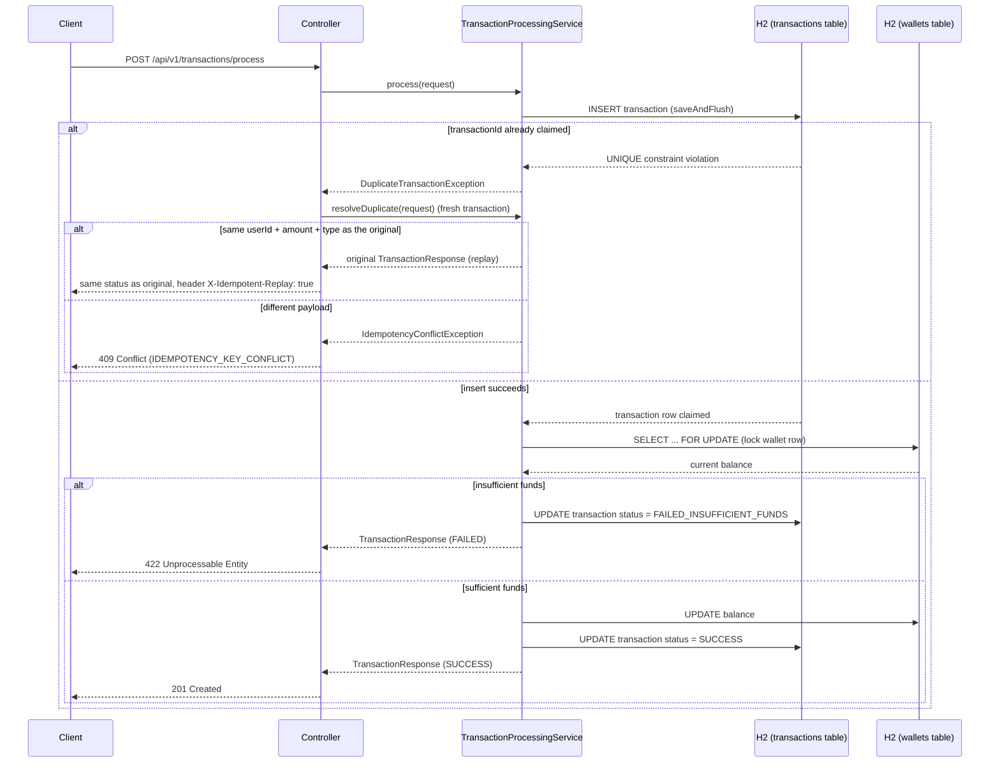

# Idempotent Payment/Wallet Event Processor

A small, production-quality wallet transaction processor built as an internship
assignment. It processes debit/credit requests against a wallet balance while
guaranteeing two things under real concurrency: the same `transactionId` is never
applied twice, and a wallet's balance can never go negative.

```
payment-wallet-processor/
├── backend/     Spring Boot API (Java 25, Spring Boot 3.5, H2, JPA)
├── frontend/    React + TypeScript dashboard (Vite, Tailwind) + Manual Test Lab
├── DECISIONS.md Required design-rationale writeup
└── README.md    This file
```

## 1. Overview

**Problem being solved:** payment/webhook systems routinely deliver the same event
more than once (client retries, network timeouts, load balancer replays), and
multiple events for the same account can arrive at the same instant. A processor
that isn't built for this can double-charge a user or let a wallet balance go
negative under load. This project processes wallet debit/credit events so that:

- the same `transactionId` is applied **at most once**, even if it arrives
  multiple times concurrently - and a safe retry (same key, same payload) gets
  back the original result instead of an error;
- reusing a `transactionId` for a **different** payload is rejected as a conflict,
  never silently applied;
- concurrent debits against one wallet **never** push the balance below zero.

## 2. Architecture

```
Controller  (REST, request validation)
    ↓
Service     (@Transactional, idempotency + locking + business logic)
    ↓
Repository  (Spring Data JPA)
    ↓
H2          (in-memory database)
```

Three layers, no extra abstraction for its own sake. `TransactionProcessingService`
owns the entire idempotent-debit flow - that's deliberate, so a reviewer can read
one class and see the whole guarantee, rather than tracing logic scattered across
five collaborating classes.



## 3. Technology stack

| Layer     | Choice                                                        |
|-----------|-----------------------------------------------------------------|
| Backend   | Java 25, Spring Boot 3.5.16, Spring Data JPA/Hibernate, Maven 3.9 (wrapper included) |
| Database  | H2 (in-memory) - zero external setup                           |
| API docs  | springdoc-openapi / Swagger UI (`/swagger-ui.html`)             |
| Testing   | JUnit 5, Spring Boot Test, AssertJ, real `ExecutorService`/`CountDownLatch` concurrency |
| Frontend  | React 19, TypeScript, Vite, Tailwind CSS, React Router, lucide-react |

No Kafka, Redis, Docker, or microservices - the assignment explicitly asks for a
simple, understandable architecture, and none of those tools are needed to satisfy
the requirements.

## 4. Database design

**`wallets`**

| column     | type            | notes                        |
|------------|-----------------|-------------------------------|
| id         | UUID (PK)       |                               |
| user_id    | UUID            | `UNIQUE` - one wallet per user |
| balance    | NUMERIC(19,4)   | `BigDecimal` - never float/double. `CHECK (balance >= 0)` |
| created_at | TIMESTAMP       |                               |
| updated_at | TIMESTAMP       |                               |

**`transactions`**

| column         | type            | notes                              |
|----------------|-----------------|--------------------------------------|
| id             | UUID (PK)       |                                     |
| transaction_id | UUID            | **`UNIQUE`** - the idempotency key  |
| user_id        | UUID            |                                     |
| amount         | NUMERIC(19,4)   | `BigDecimal`                        |
| type           | VARCHAR         | `DEBIT` / `CREDIT`                  |
| status         | VARCHAR         | `SUCCESS` / `FAILED_INSUFFICIENT_FUNDS` |
| created_at     | TIMESTAMP       |                                     |
| updated_at     | TIMESTAMP       |                                     |

The `UNIQUE` constraint on `transaction_id` is why idempotency is a database
guarantee and not an application-level convention: even if two application
instances raced to process the same transactionId with no shared memory between
them, the constraint alone would still stop the double-processing.

**Which guarantee is enforced where:**

| Guarantee                          | Application code                                   | Database constraint                          | Transaction isolation/locking |
|-------------------------------------|-----------------------------------------------------|------------------------------------------------|---------------------------------|
| No duplicate transactionId          | `claimTransactionId` attempts insert first          | `UNIQUE(transaction_id)`                        | `saveAndFlush` forces immediate constraint check |
| Balance never negative              | Pre-debit `balance >= amount` check (produces the friendly 422) | `CHECK (balance >= 0)` (last line of defense) | `SELECT ... FOR UPDATE` (`PESSIMISTIC_WRITE`) makes the check-then-debit atomic under concurrency |
| One wallet per user                 | -                                                    | `UNIQUE(user_id)`                                | -                                |
| Claim + debit + status update atomic| Single `@Transactional` method                       | -                                                | Default `REQUIRED` propagation, commit/rollback as one unit |

A `transactions` row is written even when the attempt fails due to insufficient
funds - the table doubles as a complete audit trail of every attempt, not just
successful ones.

## 5. Idempotency strategy

See [DECISIONS.md](./DECISIONS.md#1-how-did-you-handle-the-concurrency-race-condition)
for the full reasoning. In short: the transaction row is inserted and flushed
**before** the wallet is touched, so the database's `UNIQUE` constraint is checked
synchronously, mid-request - not deferred to commit time where it would be too late
to keep the two duplicate requests from both reaching the wallet.

**What happens when a `transactionId` is reused** depends on the payload:

| Reused transactionId, payload is... | Response | Financial effect |
|---------------------------------------|----------|--------------------|
| **Identical** (same userId, amount, type) | Same status as the original (201/422), header `X-Idempotent-Replay: true`, original result body | None - the original result is returned again |
| **Different** (any of userId/amount/type differs) | `409 Conflict`, `error: IDEMPOTENCY_KEY_CONFLICT` | None - rejected before touching the wallet |

This is deliberately closer to production idempotency-key semantics (as used by
payment APIs like Stripe's) than a blanket "any duplicate is a 409": a caller whose
retry is indistinguishable from its original request gets the original result back,
while a transactionId collision with a genuinely different payload is refused,
never silently applied. See [DECISIONS.md](./DECISIONS.md) for why this replaces
the earlier "every duplicate is a 409, no replay" design.

## 6. Concurrency strategy

`WalletRepository.findByUserIdForUpdate` uses `@Lock(LockModeType.PESSIMISTIC_WRITE)`,
issuing `SELECT ... FOR UPDATE`. Any other request trying to debit the same wallet
blocks until the current transaction commits or rolls back, so every request reads
the true, latest balance - never a stale value another concurrent request is about
to invalidate.

The transactionId claim and the wallet lock are acquired in that order, in every
request, so there's no possibility of two requests each holding one resource and
waiting on the other - no lock-ordering deadlock.

## 7. API endpoints

Full interactive documentation (generated from the code, so it can't drift) is at
`http://localhost:8080/swagger-ui.html` while the backend is running.

### `POST /api/v1/transactions/process` (required)

```json
// Request
{
  "transactionId": "a1b2c3d4-0000-0000-0000-000000000001",
  "userId": "9f8e7d6c-0000-0000-0000-000000000001",
  "amount": 250.00,
  "type": "DEBIT"
}
```

| Outcome                              | Status | Body                                    |
|----------------------------------------|--------|------------------------------------------|
| Processed successfully                 | 201    | `TransactionResponse`, `status: SUCCESS` |
| Insufficient funds                     | 422    | `TransactionResponse`, `status: FAILED_INSUFFICIENT_FUNDS` |
| Idempotent replay (same key, same payload) | 201/422, header `X-Idempotent-Replay: true` | Original `TransactionResponse` |
| Idempotency conflict (same key, different payload) | 409 | `ErrorResponse`, `error: IDEMPOTENCY_KEY_CONFLICT` |
| Validation error (incl. amount out of range) | 400 | `ErrorResponse`, `error: VALIDATION_ERROR` |
| Unknown userId                          | 404    | `ErrorResponse`, `error: WALLET_NOT_FOUND` |

```json
// 201 response
{
  "transactionId": "a1b2c3d4-0000-0000-0000-000000000001",
  "userId": "9f8e7d6c-0000-0000-0000-000000000001",
  "amount": 250.00,
  "type": "DEBIT",
  "status": "SUCCESS",
  "walletBalanceAfter": 250.00,
  "processedAt": "2026-09-08T10:15:30Z"
}
```

```json
// 409 response (idempotency conflict)
{
  "timestamp": "2026-09-08T10:15:31Z",
  "status": 409,
  "error": "IDEMPOTENCY_KEY_CONFLICT",
  "message": "Transaction a1b2c3d4-... already exists with a different request payload ...",
  "path": "/api/v1/transactions/process"
}
```

### Supporting endpoints

| Method | Path                              | Purpose                              |
|--------|-------------------------------------|----------------------------------------|
| GET    | `/api/v1/wallets/{userId}`          | Fetch wallet balance                  |
| POST   | `/api/v1/wallets`                   | Create a demo wallet (setup convenience, not a core requirement) |
| GET    | `/api/v1/transactions?userId={id}`  | List a user's transaction history     |

## 8. How to run the backend

Requires a JDK (25, matching `pom.xml`) - Maven itself is **not** required, since the
Maven Wrapper is checked in.

```bash
cd backend
./mvnw spring-boot:run          # macOS/Linux
mvnw.cmd spring-boot:run        # Windows
```

(If you have Maven 3.9+ installed and prefer it: `mvn spring-boot:run` works the same way.)

The API starts on `http://localhost:8080`. H2 is in-memory - a fresh database is
created every time the app starts, no setup required. An H2 web console is
available at `http://localhost:8080/h2-console` (JDBC URL:
`jdbc:h2:mem:paymentwallet`, user `sa`, blank password), and Swagger UI at
`http://localhost:8080/swagger-ui.html`, both while the app is running in the
default (dev/demo) profile.

To run with the leaner `prod` profile (H2 console disabled, no auto schema changes):

```bash
./mvnw spring-boot:run -Dspring-boot.run.profiles=prod
```

## 9. How to run the frontend

Requires Node 20+ (developed/tested with Node 24).

```bash
cd frontend
npm install
cp .env.example .env   # VITE_API_BASE_URL, defaults to http://localhost:8080
npm run dev
```

Opens on `http://localhost:5173`. Make sure the backend is running first - the
dashboard has no working demo data without it. Use the "New wallet" switcher in the
top-right of any page to create a funded demo wallet and start processing
transactions against it, or head straight to **Test Lab** in the sidebar.

## 10. How to run the tests

```bash
cd backend
./mvnw test          # or mvnw.cmd test on Windows, or mvn test
```

All 15 tests pass against a real, fully-started Spring Boot app + H2 (see
`TransactionProcessingIntegrationTest`) - this has been run and verified, not just
written; see [DECISIONS.md](./DECISIONS.md) for the (now-resolved) note on that.

## 11. Test scenarios

| Test | What it verifies |
|------|-------------------|
| Single valid debit / credit | A straightforward transaction changes the wallet balance by the correct amount. |
| 3 identical transactionIds, sent concurrently | Exactly one claims the transactionId and debits the wallet; the other two get the *same* result replayed back (`X-Idempotent-Replay: true`), never an error - and the wallet is only ever debited once. |
| 10 concurrent debits, ₹500 balance, ₹100 each | Exactly 5 succeed, 5 fail with 422, final balance is exactly ₹0 - never negative. |
| Same transactionId + different amount / userId | Rejected with 409 `IDEMPOTENCY_KEY_CONFLICT` - never silently applied with the new payload. |
| Insufficient funds | Recorded in the audit trail as `FAILED_INSUFFICIENT_FUNDS`; wallet balance is untouched. |
| Negative amount / amount over the maximum | 400 `VALIDATION_ERROR`. |
| Unknown wallet | 404 `WALLET_NOT_FOUND`. |
| Wallet creation, duplicate wallet, wallet lookup, transaction history listing | Basic CRUD/read-path correctness beyond the concurrency scenarios. |

## 12. Manual Test Lab

The frontend includes a dedicated **Test Lab** page (`/test-lab`) that exercises the
real backend - not a simulation - so the concurrency and idempotency guarantees
above can be watched happening live, without Postman or curl:

- **Concurrent duplicate payment** - fires N concurrent requests with the *same*
  transactionId and shows exactly one fresh success plus N-1 replays, with a live
  request-by-request table and a final "1 financial effect" banner.
- **Concurrent wallet debit race** - fires N concurrent debits against one wallet
  and shows the split between successes and insufficient-funds rejections, plus the
  final balance.
- **Idempotency conflict** - sends the same transactionId twice with different
  amounts and shows the resulting 409, explaining why.
- **Insufficient balance** - a single debit larger than the balance, showing the
  balance is unchanged.
- **Successful payment** - a plain single debit, end to end.

Each card includes a "How it works" / "Why this test matters" panel explaining the
mechanism in terms of the actual code (the unique constraint, the pessimistic lock,
the transaction boundary), and a "Create demo wallet" / "Reset demo wallet" flow so
nothing important is ever at risk of being touched by a test run.

## 13. Design decisions

See [DECISIONS.md](./DECISIONS.md) - it directly answers the assignment's required
questions (how the race conditions were handled, and an honest account of the
AI-assisted process's actual limitations) plus the smaller documented tradeoffs
(idempotent replay vs. a blanket 409, insufficient-funds-as-outcome-not-exception,
one wallet per user, no auth, H2 vs. a production database).

## 14. Known limitations

- **Single-node, single-database design.** The idempotency and concurrency
  guarantees rely on one relational database being the single source of truth.
  A multi-database/sharded deployment would need a different approach (e.g. a
  dedicated idempotency-key store consulted before routing to a shard).
- **H2 in-memory only.** Data does not survive a restart, by design (see
  DECISIONS.md for why H2 was chosen and what would change for Postgres).
- **No authentication.** `userId` is passed directly in requests; fine for an
  internal processor demo, not for a public-facing API.
- **No pagination** on `GET /api/v1/transactions` - fine at demo scale, would need
  it once a wallet accumulates a large history.

## 15. Future improvements

- Pagination on `GET /api/v1/transactions` once history grows large.
- A real database (Postgres) for anything beyond a demo/interview context, with the
  concurrency tests re-run against it (see the H2-vs-production locking note in
  DECISIONS.md), plus a real migration tool (Flyway/Liquibase) instead of
  `ddl-auto`.
- Multi-wallet-per-user support, if the domain ever needs it.
- Rate limiting / auth, if this were ever exposed beyond an internal network.
